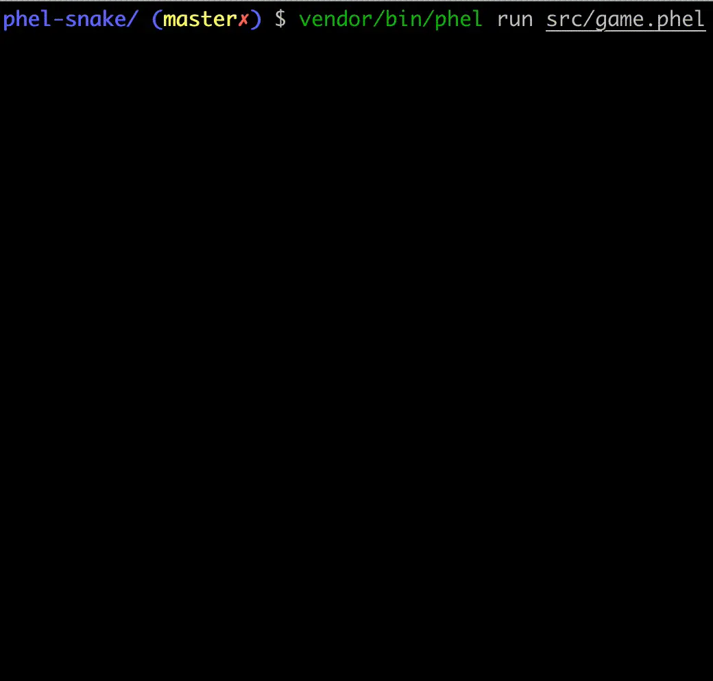

# Phel Snake

A cli-game written in [Phel](https://phel-lang.org/).

## How to play

### Instructions

Use the arrow keys to move the snake: `left-right-top-down`.
You can use the `space-key` to accelerate a few cells the snake in the current direction.

The snake will automatically increase the speed after each goal reached, unless you enable the "good mode" (using the argument `good-mode`).

The game ends when the snake touches any border of the board.

### Setup

#### Using Docker

1. Clone this repo
2. Build the image and run the container: `docker-compose up --build -d`
3. Run the game: `docker exec -it phel_snake ./tools/composer play`

#### Locally (no Docker)

1. Ensure you have PHP `>=8.0`
   1. Some help about how to install multiple PHP versions locally on [linux](https://github.com/phpbrew/phpbrew) and [Mac](https://github.com/shivammathur/homebrew-php)
2. Clone this repo
3. Install the dependencies: `./tools/composer install`
4. Run the game: `./tools/composer play`

---

Alternatively, you can run the game using the `phel run` command
You can define some optional arguments
- width={N} -> width of the board
- height={N} -> height of the board
- good-mode -> the snake won't increment the speed as it eats apples
- debug -> you can see internal stats of the game

```bash
vendor/bin/phel run src/game.phel width=40 height=15 good-mode debug
```

## Demo

