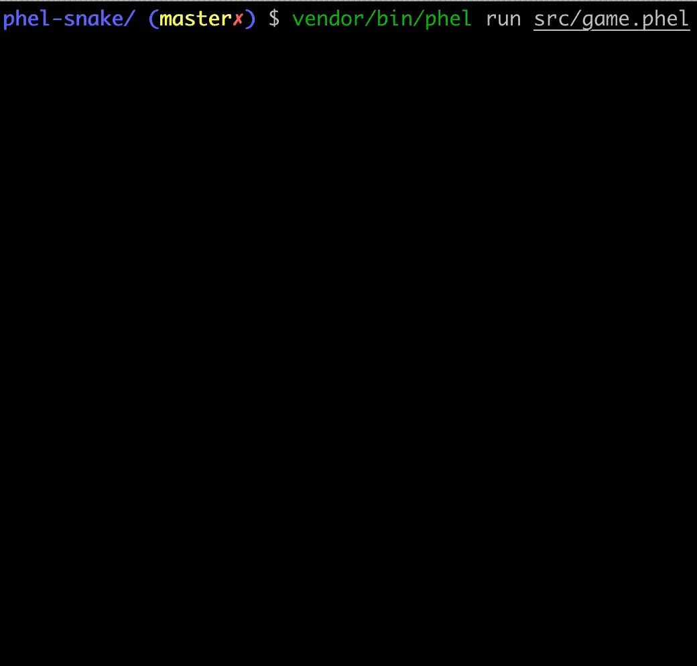

# Phel Snake

A CLI snake game written in [Phel](https://phel-lang.org/).



## Versions

- **[Full version](src/full-version/game.phel)**: Snake speeds up after each goal
- **[Simple version](src/simple-version/game.phel)**: Just the snake and board

## Setup

### Docker

```bash
docker-compose up --build -d
docker exec -it phel_snake ./tools/composer play
```

### Local

Requires PHP `>=8.3` ([linux](https://github.com/phpbrew/phpbrew) | [Mac](https://github.com/shivammathur/homebrew-php))

```bash
./tools/composer install
./tools/composer play
```

## Controls

- **Arrow keys**: Move the snake (or player 1 in two-player mode)
- **WASD**: Move player 2 in two-player mode
- **Space**: Accelerate (full version)
- **P**: Pause / resume

Game ends when the snake hits the border.

## Options

```bash
vendor/bin/phel run src/main.phel [options]
```

| Option | Description |
|--------|-------------|
| `width=N` | Board width |
| `height=N` | Board height |
| `god-mode` | Disable speed increase |
| `debug` | Show internal stats |
| `simple` | Play simple version |
| `wrap` | Snake wraps around walls instead of dying |
| `obstacles[=N]` | Scatter N obstacles (default 10) on the board |
| `no-power-ups` | Disable golden/slow-down power-ups in full mode |
| `no-levels` | Disable level progression (new walls every few goals) |
| `level-every=N` | Goals needed per level (default 5) |
| `two-player` | Two snakes share the board (arrows vs WASD) |

Example:
```bash
vendor/bin/phel run src/main.phel width=40 height=15 god-mode
```
